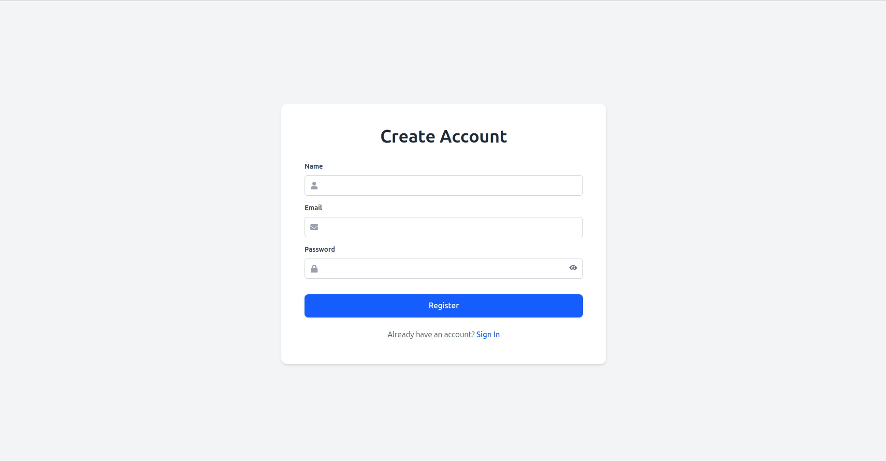
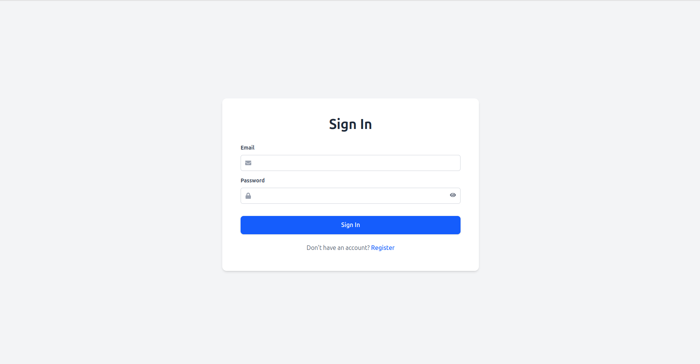
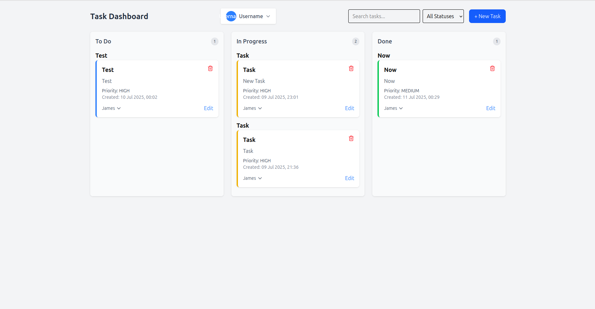

# 🗂️ Task Management Tool

A modern, full-stack **Task Management Tool** built with **Spring Boot**, **PostgreSQL**, **React**, **Tailwind CSS**, **TypeScript**, and **React Router v7**. This application allows users to manage tasks across different statuses (To Do, In Progress, Done), assign users, update task priorities, and organize work visually using drag-and-drop functionality.

### 📌 Register Page




### 📌 Login Page



### 📌 Dashboard Page




<h3>📹 Project Demo Video</h3>
<p align="center">
  <a href="./frontend/src/assets/review.mp4" target="_blank">
    
  </a>
</p>

---

## 📌 Features

### ✅ Frontend
- Built with **React** and **TypeScript**
- **Tailwind CSS** for elegant and responsive UI
- **Drag-and-drop** task movement across columns using `@dnd-kit`
- Create, update, assign, and delete tasks
- Filter tasks by status, assignee, or search keyword
- Modal forms for task creation
- Notifications for user feedback
- Built-in task priority handling
- Routing powered by **React Router v7**

### 🛠 Backend
- Developed using **Spring Boot**
- **RESTful API** architecture
- **PostgreSQL** for persistent data storage
- Supports CRUD operations on tasks and users
- JSON-based communication with frontend
- CORS configured for cross-origin requests

---

## 🧩 Tech Stack

| Layer         | Technology                   |
|---------------|------------------------------|
| Frontend      | React, TypeScript, Tailwind CSS, React Router v7 |
| Backend       | Spring Boot (Java)           |
| Database      | PostgreSQL                   |

---

## 🚀 Getting Started

### 🖥️ Prerequisites
- **Node.js** >= 18
- **Java** >= 17
- **PostgreSQL** >= 13
- Maven installed

---

### 📁 Setup Block and Instructions Below


```bash
  git clone https://github.com/yourusername/task-management-system.git
  cd task-management-system

---

 ▶️ Running the Backend


1. Navigate To Backend Directory

cd backend

2. Configure The Database Credentials.

    Create a PostgreSQL database:
      QUERY: CREATE DATABASE task_management_system;

      THEN:
      QUERY: GRANT ALL PRIVILEGES ON DATABASE task_management_system TO postgres;

3. Configure the database credentials
   
   Edit the file at src/main/resources/application.properties:

   spring.datasource.url=jdbc:postgresql://localhost:5432/taskdb
   spring.datasource.username=your_db_username
   spring.datasource.password=your_db_password
   spring.jpa.hibernate.ddl-auto=update

 
4. Run the backend server

   ./mvnw spring-boot:run


▶️ Running the Frontend


1. Navigate To Backend Directory

cd ../frontend

2. Install Dependencies.

  npm install

3. Run Frontend Script

  npm run dev

